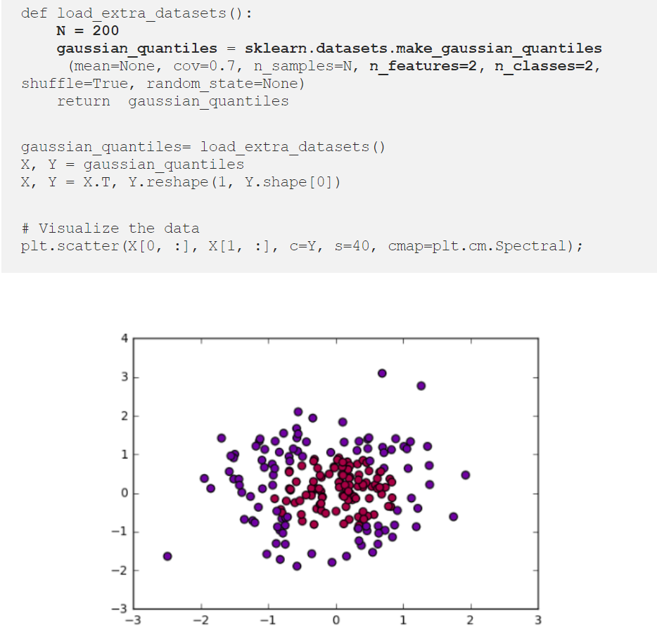
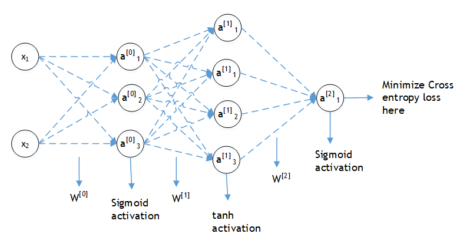
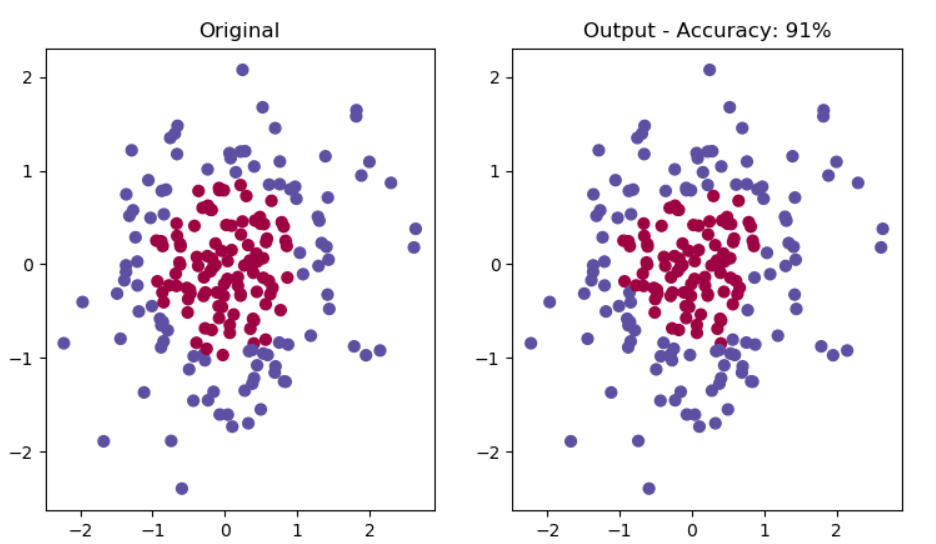

### Submission  

<h1 style='text-align: center'> COMSATS University, Islamabad </h1>
<h1 style='text-align: center'> Department of Computer Science </h1>
<h1 style='text-align: center'> CSC483 - Topics in Computer Science II (Programming for Artificial Intelligence) </h1>
<h2 style='text-align: center'> Assignment 03 </h2>
<h2 style='text-align: center'> Submitted by: Waleed Butt SP18-BCS-170 </h2>

## Question
Do the following in python and only attach a single .py file in the portal. **For computation and visuzalization, you are to use numpy and matplotlib only. Do not use python libs related to machine learning including pytorch, sklearn or tensorflow etc**. This should be implemented using simple matrix multiplication operations for which numpy is sufficient.  

### Dataset Generation
You can use sklearn (for data generation purposes only) in the following way,  
  

Here the output Y represents a vector of binary probabilities corresponding to X and can attain values of either 1 or 0. Your task is to fit a a two layer neural network that receives X and produces the predictions that accurately match the binary probabilites vector Y.  

The two layer network is shown below. Each layer has a unique specified activation function that is applied on a linear combination of the preceding neurons. Find the network parameters including weight matrices W and biases B, such that the cross entropy loss is minimized at the end. For details related to binary cross entropy loss [click here](https://ml-cheatsheet.readthedocs.io/en/latest/loss_functions.html)  

  

Finally predict the final output using the found parameters and see how the output predictions match initial data. Also display the network accuracy in the end. Your output should look something like below,  

  

**Hint**: A sample single layer network is discussed at [towardsdatascience.com](https://towardsdatascience.com/neural-net-from-scratch-using-numpy-71a31f6e3675) for which the corresponding numpy code is available at [my github](https://github.com/sohaibali01/programming_AI/blob/main/test_neural.py). Following the code, you can initialize the parameters in the following way,  
W0 = np.random.randn(n_h0,n_x) * 0.05  

b0 = np.zeros(shape=(n_h0, 1))  

W1 = np.random.randn(n_h1,n_h0) * 0.05  

b1 = np.zeros(shape=(n_h1, 1))  

W2 = np.random.randn(n_y,n_h1) * 0.05  

b2 = np.zeros(shape=(n_y, 1))  

num_iterations = 3000  

learning_rate = 3  