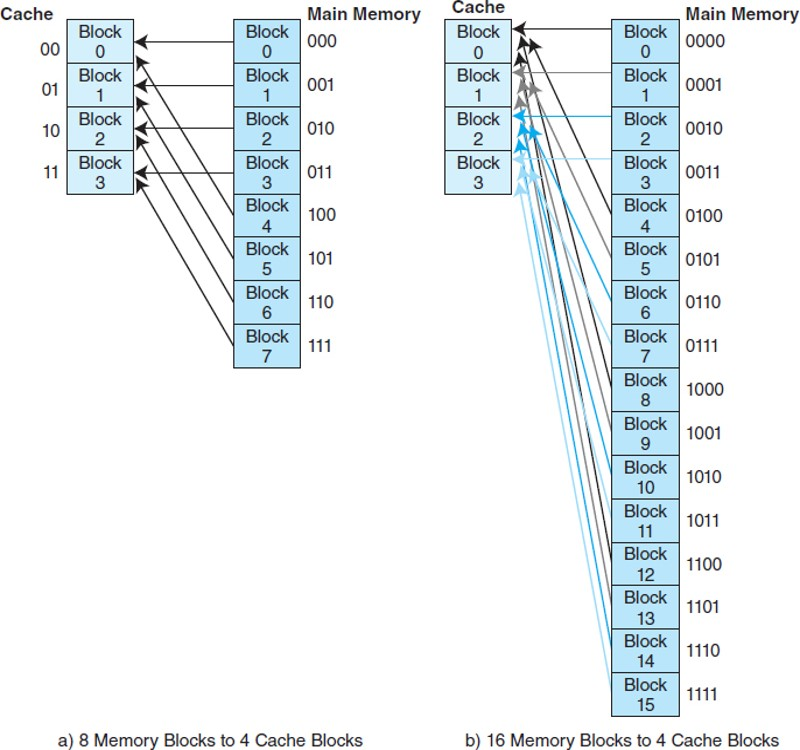
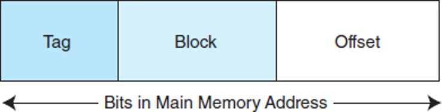
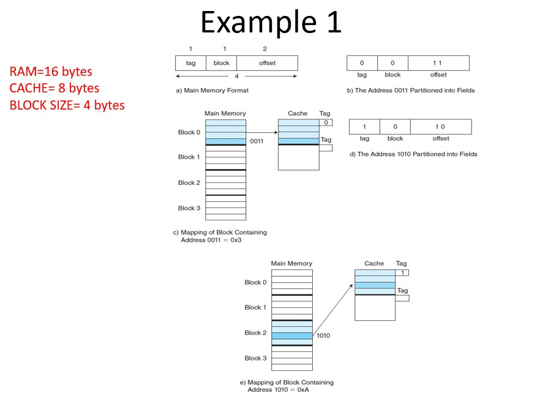
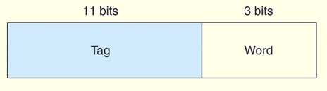
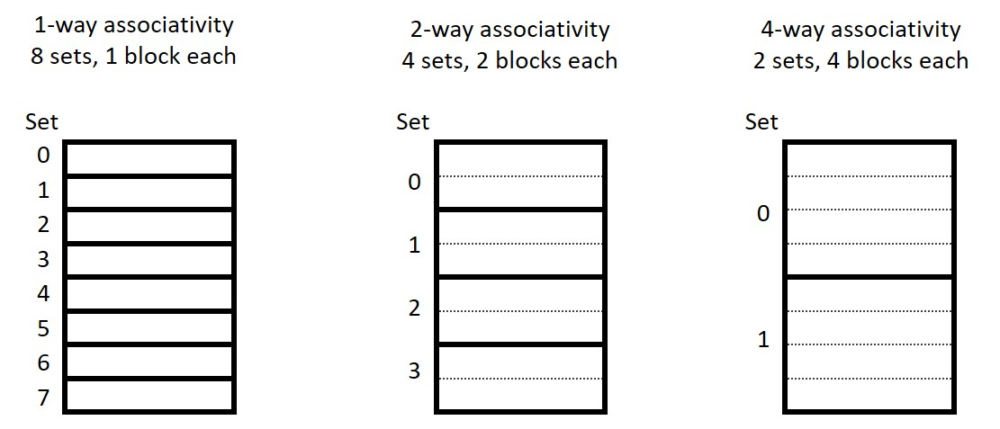
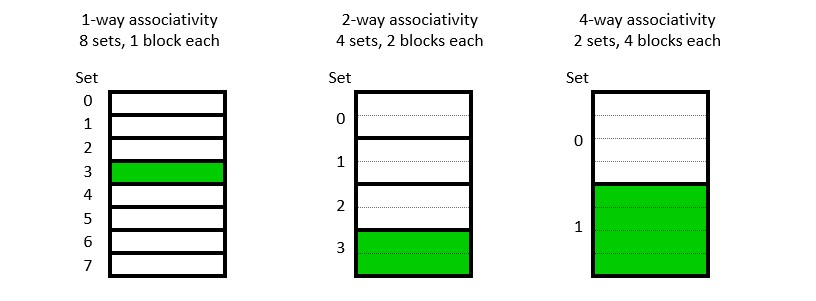
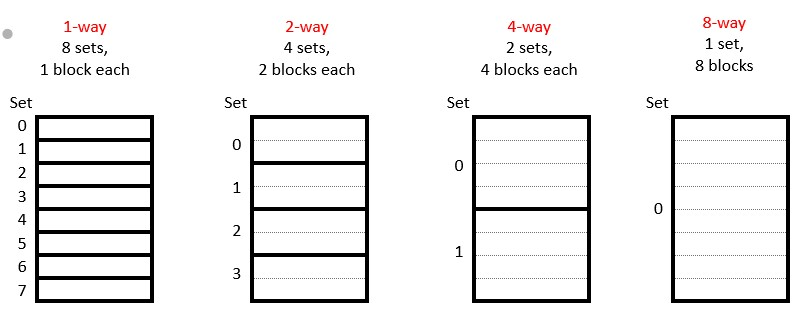
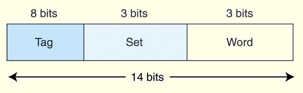

# Cache Simulator
A simple program that shows the behaviour of cache on the different addresses 
coming towards it.
## Cache
Request goes to cache controller.  
If data found in cache memory, loaded to CPU  
Else  
Request goes to next level
Data found, whole block in which data resides is transferred to previous level
(E.g. Accessing of data X will brought X+1, X+2,… etc as well) 
ELSE  
Request goes to next level and so on….  

## Hit and Miss
* A hit is when data is found at a given memory level.  
* A miss is when it is not found.  
* The hit rate is the percentage of time data is found at a given memory level.  
* The miss rate is the percentage of time it is not.   
* Miss rate = 1 - hit rate.  
* The hit time is the time required to access data at a given memory level.  
* The miss penalty is the time required to process a miss, including the time that it takes to replace a block of memory plus the time it takes to deliver the data to the processor.  

## Data Access from Cache
CPU generates main memory address for any instruction’s access.  
Where to see in cache?  
Mapping scheme maps address to cache location  
Address is divided into 2/3 fields  
Helps determine where instruction is copied in cache/where to find in cache if already copied.  

## How data is found/copied?
Main memory + cache divided into equal sized blocks.  
Address divided into fields  
One field (block number) tells where instruction is residing(cache hit)/should reside(cache miss) block finding.  
	Next to see that block is valid/not  (valid bit associated with cache block = 0/1).  
Other field tells that if valid bit=1, the block is same where our instruction exists  (tag bits).  
Last field (offset number) takes us to exact instruction inside block.  

## Mapping Schemes
Three types
1. Direct Mapped  
2. Fully Associative Mapped 
3. N-way Set Associative mapped  

## Direct Mapped Cache
More memory blocks than cache blocks  
Blocks competition   
	for cache  
Block X copied to   
	block Y % N, Where   
	N= no of blocks in   
		cache  




### Sample Output  
```seq
Ram Size = 2^16 bytes.  
Cache Size = 4096 bytes.  
Block Size = 8 bytes.  
Instruction Length = 16 bits.  
we need 512 blocks to create entire cache.  
Tag Bits = 16 - (3+9) = 4 bits.  
Block bits = 512 = 2 ^ 9 = 9 bits.  
Offset bits = 8 = 2 ^ 3 = 3 bits.  
------------------------------------------------------------------------------------------------	
Address	|Binary			|Block Num	|Block Data	|Hit or Miss|Block Data After	|  
------------------------------------------------------------------------------------------------
900	|0000001110000100	|112		|--------	|Miss		|896 - 903	|  
901	|0000001110000101	|112		|896-896	|Hit		|896 - 903	|  
902	|0000001110000110	|112		|896-896	|Hit		|896 - 903	|  
903	|0000001110000111	|112		|896-896	|Hit		|896 - 903	|  
904	|0000001110001000	|113		|--------	|Miss		|904 - 911	|  
905	|0000001110001001	|113		|904-904	|Hit		|904 - 911	|  
906	|0000001110001010	|113		|904-904	|Hit		|904 - 911	|  
907	|0000001110001011	|113		|904-904	|Hit		|904 - 911	|  
```
## Fully Associative
* Allow a block to go anywhere in cache.  
* In this way, cache would have to fill up before any blocks are evicted.  
* A memory address is partitioned into only two fields: the tag and the word.  
* Suppose, as before, we have 14-bit memory addresses and a cache with 16 blocks,
* each block of size 8.  
* The field format of a memory reference is:

* You will recall that direct mapped cache evicts a block whenever another memory reference needs that block.
* With fully associative cache, we have no such mapping, thus we must devise an algorithm to determine which block to evict from the cache.
* The block that is evicted is the victim block.
* There are a number of ways to pick a victim.
	* FIFO (First in first Out)
	* LRU (Least Recently Used)
	* Optimal (Less to be used in future) etc.
* When the cache is searched, all tags are searched in parallel to retrieve the data quickly. This requires special, costly hardware.

## n-Way Set Associative
* An intermediate possibility is a set-associative cache.
* The cache is divided into groups of blocks, called sets.
* Each memory address maps to exactly one set in the cache, but data may be placed in any block within that set.
* An intermediate possibility is a set-associative cache.
* The cache is divided into groups of blocks, called sets.
* Each memory address maps to exactly one set in the cache, but data may be placed in any block within that set.
* If each set has 2x blocks, the cache is an 2x-way associative cache. 
* Here are several possible organizations of an eight-block cache.

### Block Replacement
* Any empty block in the correct set may be used for storing data.  
* If there are no empty blocks, the cache controller will attempt to replace the victim block, just like before.   
* For highly associative caches, it’s expensive to keep track of what’s really the least recently used block, so some approximations are used. We won’t get into the details.  

* By now you may have noticed the 1-way set associative cache is the same as a direct-mapped cache.  
* Similarly, if a cache has 2k blocks, a 2k-way set associative cache would be the same as a fully-associative cache.  

### Example
* Suppose we have a main memory of 214 bytes.
* This memory is mapped to a 2-way set associative cache having 16 blocks where each block contains 8 words.
* Since this is a 2-way cache, each set consists of 2 blocks, and there are 8 sets.
* Thus, we need 3 bits for the set, 3 bits for the word, giving 8 leftover bits for the tag:

## Effective Access Time (EAT)
* The performance of hierarchical memory is measured by its effective access time (EAT).
* EAT is a weighted average that takes into account the hit ratio and relative access times of successive levels of memory.
* The EAT for a two-level memory is given by:
	* EAT = H  AccessC + (1-H)  AccessMM.
	* where H is the cache hit rate and AccessC and AccessMM are the access times for cache and main memory, respectively.
### Example
Consider a system with a main memory access time of 200ns supported by a cache having a 10ns access time and a hit rate of 99%.
The EAT is:
	0.99(10ns) + 0.01(200ns) = 9.9ns + 2ns = 11ns.
This equation for determining the effective access time can be extended to any number of memory levels