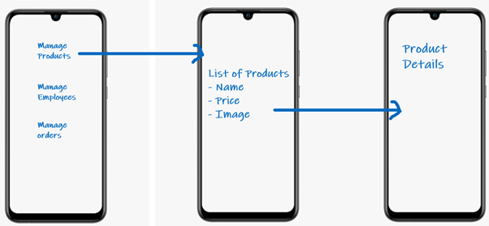

# Lab 9 – Admin Mobile App for an Online Store

We will develop an Admin Mobile Application for an Online Store. App will have multiple screens to perform different operations.  
This a brief sketch of the screens:  

## Tasks:
Create Stack Navigator to navigate between the screens. There are following screens:
1.	Home Screen containing buttons to navigate to other screens. These are as displayed in the sketch
2.	Manage Products will navigate to the list of products screen. You can use hardcoded list of products to be displayed  
2.1.	When user taps on the product, it navigates to the Product Details screens where detailed information of the product is displayed
3.	Manage Employees will navigate to the list of Employees screen. Where Name and the Designation of an employee is displayed.  
3.1.	When user taps on one of the employee, it navigates to the employee details screen
4.	Manage Orders will navigate to the list of Orders screen. Where Order Number, Product Name, Price is displayed.  
4.1.	When user taps on one order, it navigates to the order details screen to see details of the order, such as, customer information, order date, shipping status etc
## Instructions:
You will be using hardcoded lists to display data. Data can be loaded and displayed on listing screen (products list, employees list, orders list). Further navigating from the listing screen will send the data to the next screen.
Implement proper navigation flow with the appropriate header information of each screen.
Home screen does not need to have the header
